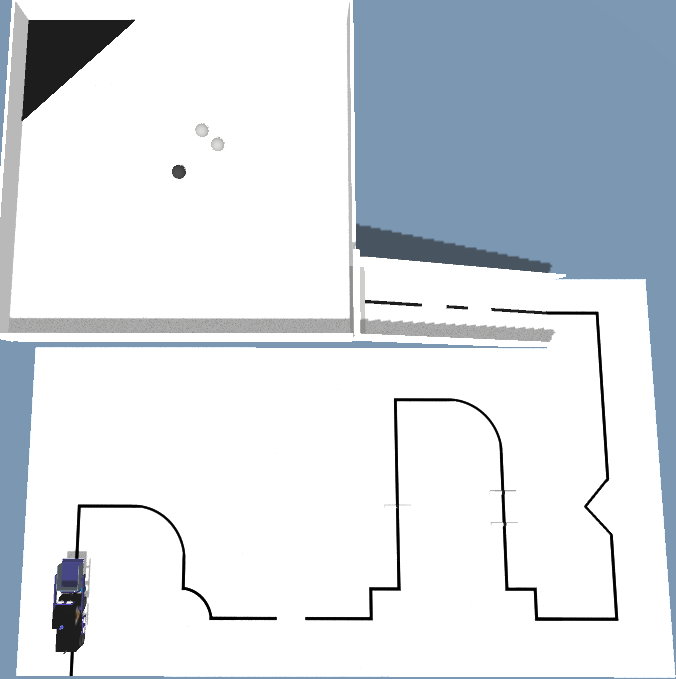
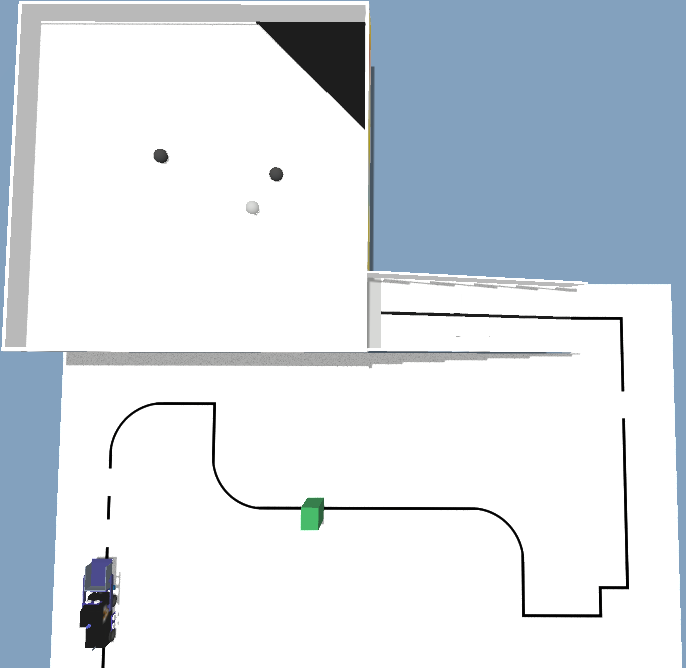
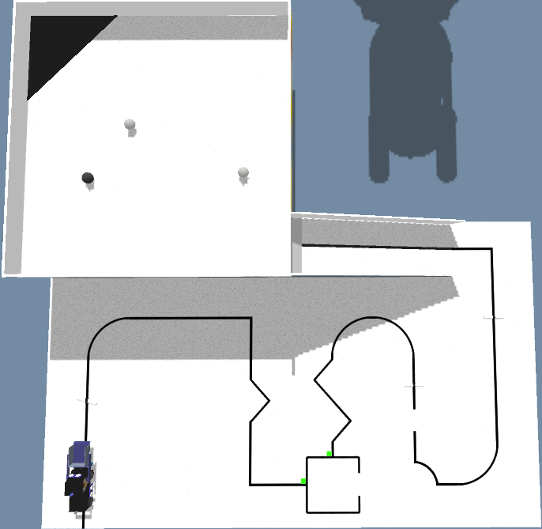
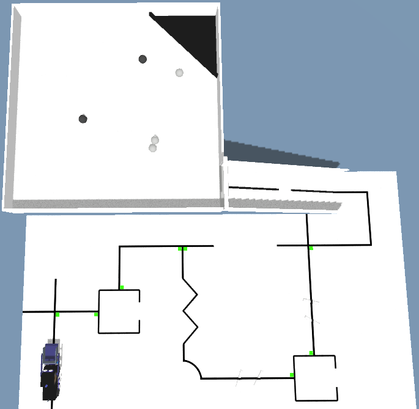
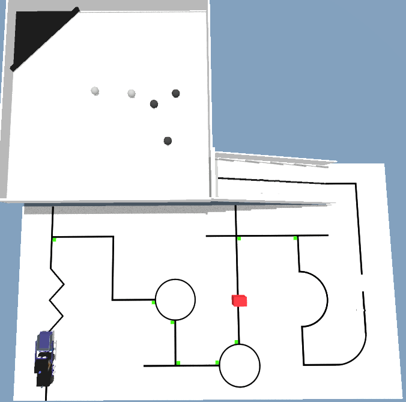

# Arenas-Estaduais-OBR-2020
Arenas da etapa estadual da OBR 2020 modalidade prática simulação

[Nível 1](#Nível-1)
1. [Dia 16/10 - AC / PR / PI / MS / RR](#dia-1610---ac--pr--pi--ms--rr)

[Nível 2](#Nível-2)
1. [Dia 16/10 - AC / PR / PI / MS / RR](#dia-1610---ac--pr--pi--ms--rr-1)


# Nível 1

## Dia 16/10 - AC / PR / PI / MS / RR

### Rodada 1 (Pontuação máxima: 365)

```
0000r0000,0010c1000,1010c0090,1000ch270,2000r1270,3000cf180,3010r2000,3020c1000,4020c0090,4010rm180,4000cj270,5000c1180,5010rP180,5020r0180,5,BoolTpFim: true,BoolShowM: true,BoolMrcdr: true,BoolPrgso: true,BoolEndCd: false,HoraDoDia: 8,BoolTSala: 1,VtmsVivas: 2,VtmsMrtas: 1,BoolSlnha: true,RobosPerm: 111110,Descricao: Rodada 1 - Primeiras estaduais,TempoMxmo: 3
```



### Rodada 2 (Pontuação máxima: 365)

```
0000r0000,0010rx180,0020c0000,1020c1090,1010c0270,2010r4270,3010r0270,4010cj090,4000c1270,5000cf180,5010r0180,5020r1000,4,BoolTpFim: true,BoolShowM: true,BoolMrcdr: true,BoolPrgso: true,BoolEndCd: false,HoraDoDia: 13,BoolTSala: 1,RobosPerm: 111110,BoolSlnha: true,VtmsVivas: 1,VtmsMrtas: 2,Descricao: Rodada 2 - Primeiras estaduais,TempoMxmo: 3
```



### Rodada 3 (Pontuação máxima: 365)

```
0000r0000,0010ry180,0020c0000,1020r0270,2020c1090,2010rP000,2000c1270,3000c4180,3010r3180,3020c0000,4020c0090,4010rw000,4000cj270,5000c0180,5010r0180,5020r2180,1,BoolTpFim: true,BoolShowM: true,BoolMrcdr: true,BoolPrgso: true,BoolEndCd: false,HoraDoDia: 18,BoolTSala: 1,RobosPerm: 111110,BoolSlnha: true,TempoMxmo: 3,VtmsVivas: 2,VtmsMrtas: 1,Descricao: Rodada 3 - Primeiras estaduais
```



# Nível 2

## Dia 16/10 - AC / PR / PI / MS / RR

### Rodada 1 (Pontuação máxima: 590)

```
0000r0000,0010c7000,1010ce180,1020c1000,2020c6090,2010r/000,2000ch270,3000rA270,4000c4180,4010rA180,4020c7000,5020c1180,2,VtmsMrtas: 2,BoolTpFim: true,RobosPerm: 111111,BoolShowM: true,BoolMrcdr: true,BoolPrgso: true,BoolSlnha: true,BoolTSala: 2,BoolEndCd: false,VtmsVivas: 3,HoraDoDia: 8,TempoMxmo: 3,Descricao: Rodada 1 - Primeiras estaduais
```



### Rodada 2 (Pontuação máxima: 590)

```
0000r0000,0010r/000,0020c5000,1020c1090,1010c1270,2010c2090,2000c5270,3000c2180,3010r4180,3020c7000,4020c5090,4010rU000,4000c1270,5000c0180,5010rw180,5020r0180,4,BoolTpFim: true,RobosPerm: 111111,BoolShowM: true,BoolMrcdr: true,BoolPrgso: true,BoolTSala: 2,BoolEndCd: false,HoraDoDia: 13,BoolSlnha: true,VtmsVivas: 2,VtmsMrtas: 3,Descricao: Rodada 2 - Primeiras estaduais,TempoMxmo: 3
```



### Rodada 3 (Pontuação máxima: 550)

```
0000r0000,0010rz000,0020cf000,1020rY090,2020c1090,2010r4180,2000c5270,3000rx270,4000r0270,5000c0180,5010c0090,4010r0090,3010ce270,3020cl000,4020r0090,5020c1180,5,BoolTpFim: true,RobosPerm: 111111,BoolShowM: true,BoolMrcdr: true,BoolPrgso: true,BoolTSala: 2,BoolEndCd: false,HoraDoDia: 18,VtmsMrtas: 4,VtmsVivas: 1,Descricao: Rodada 3 - Primeiras estaduais,TempoMxmo: 3,BoolSlnha: true
```

